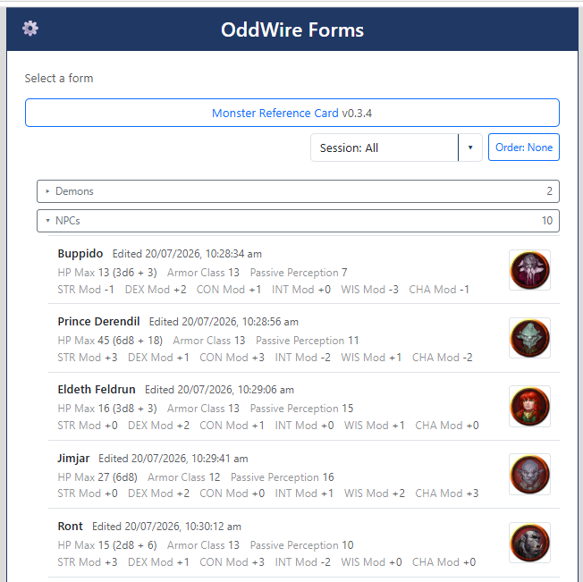
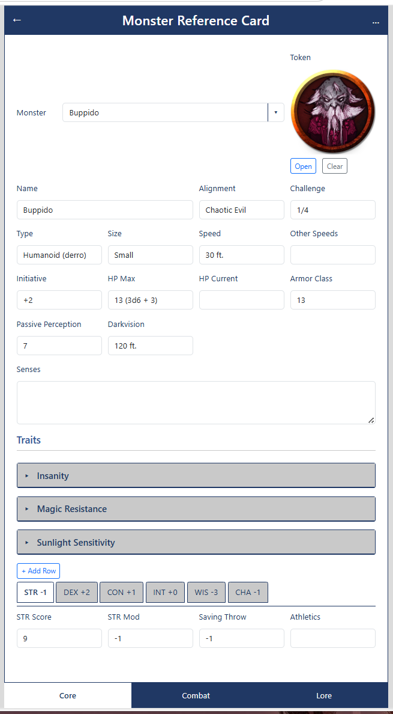
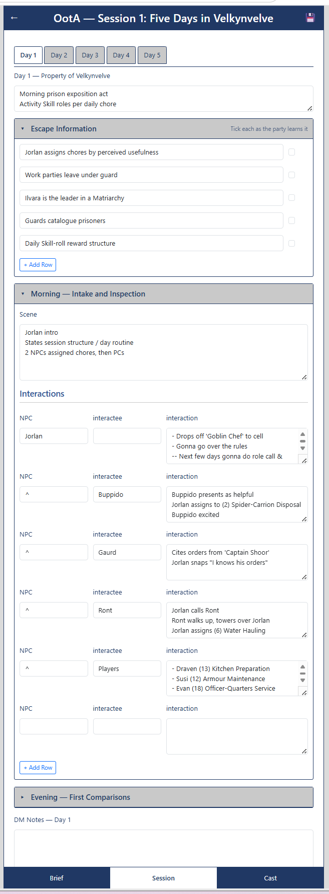

# OddWire.Form

ASP.NET Core-hosted React/TypeScript client for building and filling JSON-driven forms. The server is still a thin SPA host; the runtime, local stores, form rendering, lookup tables, and settings tools live in the client.

---

## What This Is
- Objective: Define a webpage by a JSON  config file, that lists an input (text/number/image/file) within a layout (tabs, columns, popups). These inputs then configure thier own export options, eg to an API or PDF
- Implementation: OddWire.Form renders form definitions from JSON control trees and stores live documents as sparse `param`-keyed instance overlays. A form is opened from the landing page, rendered through a dynamic control dispatcher, edited in the browser, then saved to local browser storage.
- Fun: As proof of concept we are making Dungeons and Dragon toolsets to model and export monster stats and session information

Current behaviour:
- `localforage` database seeded with form definitions and lookup tables
- Instances(active data) auto-saves to database live
  - (autosave enables after first save)
- Radio and dropdown controls resolve from lookup tables
  - On selected, the object loads all additional info 
- Layout controls support collapsibles, inline/root tabs, popups, and loopers
- Settings include a global DB Manager, form install/refresh list, and 5etools monster import

The ASP.NET Core project hosts the client and keeps the template `WeatherForecast` endpoint; there are no form/instance/lookup server endpoints yet.

---

## Screenshots

**Landing page** - installed forms with grouped, summarised saved instances.



**Monster Reference Card** - leaf controls, collapsible traits, root tabs, and a looper-driven ability strip.



**OotA Session 1** - nested collapsibles, inline day tabs, and multi-column interaction loopers.



---

## Project Map

- `OddWire.Form.slnx` - solution
- `OddWire.Form.Server/` - ASP.NET Core host and static SPA fallback
- `oddwire.form.client/` - React/TypeScript/Vite client
- `oddwire.form.client/src/_context/` - form, instance, and lookup stores; seed JSON; shared data types
- `oddwire.form.client/src/form/` - route-driven form page
- `oddwire.form.client/src/_components/controllist/` - dynamic renderer, lookup option resolver, and controls
- `oddwire.form.client/src/settings/` - DB Manager and Form Manager
- `oddwire.form.client/src/mods/5etools/` - bundled monster data importer
- `oddwire.form.client/public/style/` - global keyword CSS

---

## In-Repo Docs

- **Dynamic Form** - [Brief](oddwire.form.client/src/_components/controllist/.git.md) · [Doc](oddwire.form.client/src/_components/controllist/.gpt.md)  
  Runtime flow, stores, routing, instance overlays, lookup resolution, settings, and import workflows.
- **Form Controls** - [Brief](oddwire.form.client/src/_components/controllist/controls/.git.md) · [Doc](oddwire.form.client/src/_components/controllist/controls/.gpt.md)  
  Leaf controls, shared props, layout controls, loopers, readonly handling, DB-backed options, and styling.
- **Server Host** - scaffold support only.

---

## Build / Usage

```powershell
cd oddwire.form.client
npm install
npm run dev
npm run build
```

The Vite dev server runs HTTPS on port `59392` using the ASP.NET development certificate. Run `dotnet dev-certs https --trust` once if the browser rejects the local certificate.
